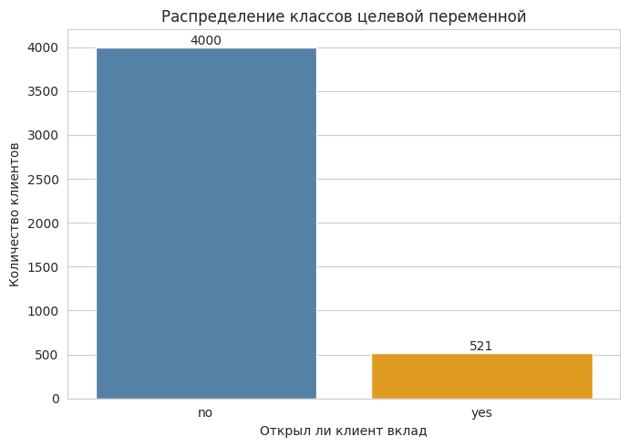
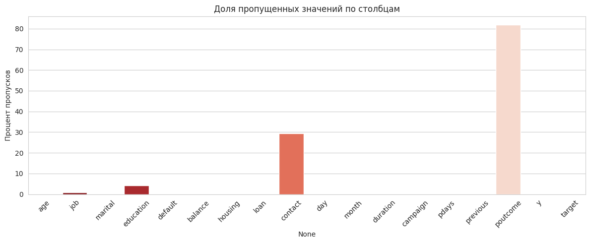
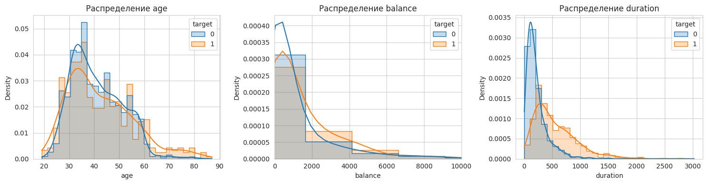
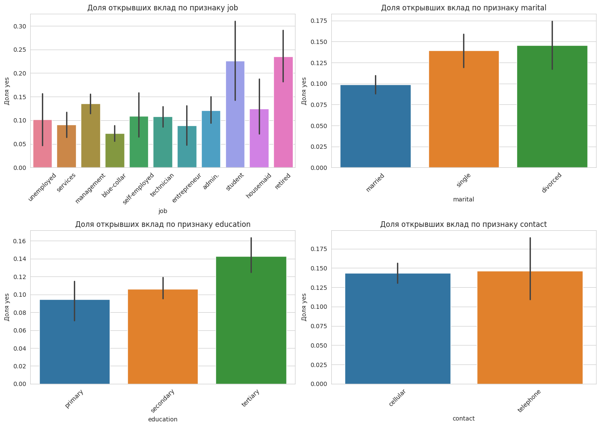
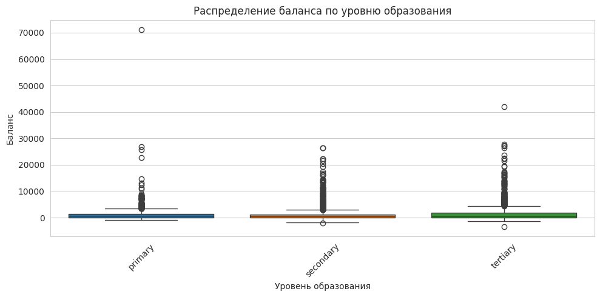
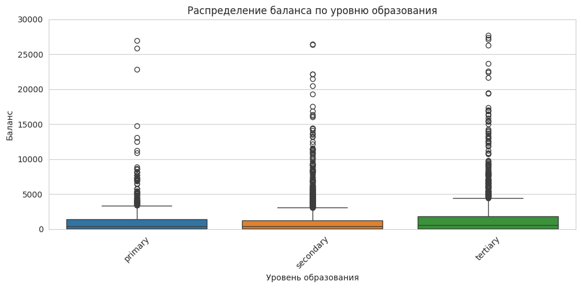

# **Практическая работа №1. Разведочный анализ, предобработка данных и построение модели классификации *(на примере датасета Bank Marketing)***

---

## **Введение**


**Цель работы:** Обучить модель машинного обучения для предсказания, откроет ли клиент банка срочный вклад по результатам маркетинговой кампании (целевая переменная `y`: "yes" — откроет, "no" — не откроет).


**Датасет:** [Bank Marketing Dataset](https://archive.ics.uci.edu/dataset/222/bank+marketing) — данные о маркетинговых кампаниях португальского банка.


**Что вы научитесь делать:**
- Загружать и исследовать данные
- Выявлять проблемы через разведочный анализ (EDA)
- Анализировать и обрабатывать пропущенные значения
- Формулировать и проверять гипотезы
- Создавать новые признаки (Feature Engineering)
- Сравнивать стратегии и выбирать лучшую модель

---

## **Часть 1. Настройка окружения**

> 📚 **Подсказка:** Аналогичная настройка рассматривалась в [**Занятии 1, Часть 1** и **Занятии 2, Часть 1**](https://colab.research.google.com/drive/1Cnp7hPUUu5dorlhPPHUeztnnoq5Z2j4W?usp=sharing#scrollTo=5f49d9aa).


```python
# Импорт библиотек
import numpy as np
import pandas as pd
import matplotlib.pyplot as plt
import seaborn as sns

from sklearn.model_selection import train_test_split
from sklearn.preprocessing import StandardScaler
from sklearn.linear_model import LogisticRegression
from sklearn.metrics import accuracy_score

# Настройки отображения
sns.set_style("whitegrid")
pd.set_option('display.max_columns', 20)
```

---

## **Часть 2. Загрузка и первичный осмотр данных**

> 📚 **Подсказка:** Методы первичного осмотра (`head()`, `info()`, `describe()`, `shape`) подробно разобраны в [**Занятии 1, Часть 3.2**](https://colab.research.google.com/drive/1Cnp7hPUUu5dorlhPPHUeztnnoq5Z2j4W?usp=sharing#scrollTo=9ef7543b) и [**Занятии 2, Часть 2.1**](https://colab.research.google.com/drive/1aT36P0Jc-dIjYOx6Hh8yecFSgt-z3Fan?usp=sharing#scrollTo=43b439e3).

### **Задание 2.1. Загрузите датасет**


```python
# Загрузка датасета Bank Marketing
url = "https://raw.githubusercontent.com/rishabhathiya/Bank-Marketing/refs/heads/main/bank.csv"
bank = pd.read_csv(url, sep=';')

# ВАЖНО: В этом датасете пропуски записаны как "unknown"
# Заменяем их на NaN, чтобы isna() корректно их определял
bank = bank.replace('unknown', np.nan)

bank.head()
```


  <div id="df-ccc8ec1a-2a2c-477e-bc91-d6be819e1979" class="colab-df-container">
    <div>
<style scoped>
    .dataframe tbody tr th:only-of-type {
        vertical-align: middle;
    }

    .dataframe tbody tr th {
        vertical-align: top;
    }

    .dataframe thead th {
        text-align: right;
    }
</style>
<table border="1" class="dataframe">
  <thead>
    <tr style="text-align: right;">
      <th></th>
      <th>age</th>
      <th>job</th>
      <th>marital</th>
      <th>education</th>
      <th>default</th>
      <th>balance</th>
      <th>housing</th>
      <th>loan</th>
      <th>contact</th>
      <th>day</th>
      <th>month</th>
      <th>duration</th>
      <th>campaign</th>
      <th>pdays</th>
      <th>previous</th>
      <th>poutcome</th>
      <th>y</th>
    </tr>
  </thead>
  <tbody>
    <tr>
      <th>0</th>
      <td>30</td>
      <td>unemployed</td>
      <td>married</td>
      <td>primary</td>
      <td>no</td>
      <td>1787</td>
      <td>no</td>
      <td>no</td>
      <td>cellular</td>
      <td>19</td>
      <td>oct</td>
      <td>79</td>
      <td>1</td>
      <td>-1</td>
      <td>0</td>
      <td>NaN</td>
      <td>no</td>
    </tr>
    <tr>
      <th>1</th>
      <td>33</td>
      <td>services</td>
      <td>married</td>
      <td>secondary</td>
      <td>no</td>
      <td>4789</td>
      <td>yes</td>
      <td>yes</td>
      <td>cellular</td>
      <td>11</td>
      <td>may</td>
      <td>220</td>
      <td>1</td>
      <td>339</td>
      <td>4</td>
      <td>failure</td>
      <td>no</td>
    </tr>
    <tr>
      <th>2</th>
      <td>35</td>
      <td>management</td>
      <td>single</td>
      <td>tertiary</td>
      <td>no</td>
      <td>1350</td>
      <td>yes</td>
      <td>no</td>
      <td>cellular</td>
      <td>16</td>
      <td>apr</td>
      <td>185</td>
      <td>1</td>
      <td>330</td>
      <td>1</td>
      <td>failure</td>
      <td>no</td>
    </tr>
    <tr>
      <th>3</th>
      <td>30</td>
      <td>management</td>
      <td>married</td>
      <td>tertiary</td>
      <td>no</td>
      <td>1476</td>
      <td>yes</td>
      <td>yes</td>
      <td>NaN</td>
      <td>3</td>
      <td>jun</td>
      <td>199</td>
      <td>4</td>
      <td>-1</td>
      <td>0</td>
      <td>NaN</td>
      <td>no</td>
    </tr>
    <tr>
      <th>4</th>
      <td>59</td>
      <td>blue-collar</td>
      <td>married</td>
      <td>secondary</td>
      <td>no</td>
      <td>0</td>
      <td>yes</td>
      <td>no</td>
      <td>NaN</td>
      <td>5</td>
      <td>may</td>
      <td>226</td>
      <td>1</td>
      <td>-1</td>
      <td>0</td>
      <td>NaN</td>
      <td>no</td>
    </tr>
  </tbody>
</table>
</div>
    <div class="colab-df-buttons">

  <div class="colab-df-container">
    <button class="colab-df-convert" onclick="convertToInteractive('df-ccc8ec1a-2a2c-477e-bc91-d6be819e1979')"
            title="Convert this dataframe to an interactive table."
            style="display:none;">

  <svg xmlns="http://www.w3.org/2000/svg" height="24px" viewBox="0 -960 960 960">
    <path d="M120-120v-720h720v720H120Zm60-500h600v-160H180v160Zm220 220h160v-160H400v160Zm0 220h160v-160H400v160ZM180-400h160v-160H180v160Zm440 0h160v-160H620v160ZM180-180h160v-160H180v160Zm440 0h160v-160H620v160Z"/>
  </svg>
    </button>

  <style>
    .colab-df-container {
      display:flex;
      gap: 12px;
    }

    .colab-df-convert {
      background-color: #E8F0FE;
      border: none;
      border-radius: 50%;
      cursor: pointer;
      display: none;
      fill: #1967D2;
      height: 32px;
      padding: 0 0 0 0;
      width: 32px;
    }

    .colab-df-convert:hover {
      background-color: #E2EBFA;
      box-shadow: 0px 1px 2px rgba(60, 64, 67, 0.3), 0px 1px 3px 1px rgba(60, 64, 67, 0.15);
      fill: #174EA6;
    }

    .colab-df-buttons div {
      margin-bottom: 4px;
    }

    [theme=dark] .colab-df-convert {
      background-color: #3B4455;
      fill: #D2E3FC;
    }

    [theme=dark] .colab-df-convert:hover {
      background-color: #434B5C;
      box-shadow: 0px 1px 3px 1px rgba(0, 0, 0, 0.15);
      filter: drop-shadow(0px 1px 2px rgba(0, 0, 0, 0.3));
      fill: #FFFFFF;
    }
  </style>

    <script>
      const buttonEl =
        document.querySelector('#df-ccc8ec1a-2a2c-477e-bc91-d6be819e1979 button.colab-df-convert');
      buttonEl.style.display =
        google.colab.kernel.accessAllowed ? 'block' : 'none';

      async function convertToInteractive(key) {
        const element = document.querySelector('#df-ccc8ec1a-2a2c-477e-bc91-d6be819e1979');
        const dataTable =
          await google.colab.kernel.invokeFunction('convertToInteractive',
                                                    [key], {});
        if (!dataTable) return;

        const docLinkHtml = 'Like what you see? Visit the ' +
          '<a target="_blank" href=https://colab.research.google.com/notebooks/data_table.ipynb>data table notebook</a>'
          + ' to learn more about interactive tables.';
        element.innerHTML = '';
        dataTable['output_type'] = 'display_data';
        await google.colab.output.renderOutput(dataTable, element);
        const docLink = document.createElement('div');
        docLink.innerHTML = docLinkHtml;
        element.appendChild(docLink);
      }
    </script>
  </div>

    </div>
  </div>


### **Задание 2.2. Изучите структуру данных**

**1. Выведите размерность датасета:**


```python
bank.shape
```


    (4521, 17)


**2. Отобразите первые 10 строк датасета**


```python
bank.head(10)

```


  <div id="df-a0781d9e-04fb-4f59-81ce-ee99cb01af5c" class="colab-df-container">
    <div>
<style scoped>
    .dataframe tbody tr th:only-of-type {
        vertical-align: middle;
    }

    .dataframe tbody tr th {
        vertical-align: top;
    }

    .dataframe thead th {
        text-align: right;
    }
</style>
<table border="1" class="dataframe">
  <thead>
    <tr style="text-align: right;">
      <th></th>
      <th>age</th>
      <th>job</th>
      <th>marital</th>
      <th>education</th>
      <th>default</th>
      <th>balance</th>
      <th>housing</th>
      <th>loan</th>
      <th>contact</th>
      <th>day</th>
      <th>month</th>
      <th>duration</th>
      <th>campaign</th>
      <th>pdays</th>
      <th>previous</th>
      <th>poutcome</th>
      <th>y</th>
    </tr>
  </thead>
  <tbody>
    <tr>
      <th>0</th>
      <td>30</td>
      <td>unemployed</td>
      <td>married</td>
      <td>primary</td>
      <td>no</td>
      <td>1787</td>
      <td>no</td>
      <td>no</td>
      <td>cellular</td>
      <td>19</td>
      <td>oct</td>
      <td>79</td>
      <td>1</td>
      <td>-1</td>
      <td>0</td>
      <td>NaN</td>
      <td>no</td>
    </tr>
    <tr>
      <th>1</th>
      <td>33</td>
      <td>services</td>
      <td>married</td>
      <td>secondary</td>
      <td>no</td>
      <td>4789</td>
      <td>yes</td>
      <td>yes</td>
      <td>cellular</td>
      <td>11</td>
      <td>may</td>
      <td>220</td>
      <td>1</td>
      <td>339</td>
      <td>4</td>
      <td>failure</td>
      <td>no</td>
    </tr>
    <tr>
      <th>2</th>
      <td>35</td>
      <td>management</td>
      <td>single</td>
      <td>tertiary</td>
      <td>no</td>
      <td>1350</td>
      <td>yes</td>
      <td>no</td>
      <td>cellular</td>
      <td>16</td>
      <td>apr</td>
      <td>185</td>
      <td>1</td>
      <td>330</td>
      <td>1</td>
      <td>failure</td>
      <td>no</td>
    </tr>
    <tr>
      <th>3</th>
      <td>30</td>
      <td>management</td>
      <td>married</td>
      <td>tertiary</td>
      <td>no</td>
      <td>1476</td>
      <td>yes</td>
      <td>yes</td>
      <td>NaN</td>
      <td>3</td>
      <td>jun</td>
      <td>199</td>
      <td>4</td>
      <td>-1</td>
      <td>0</td>
      <td>NaN</td>
      <td>no</td>
    </tr>
    <tr>
      <th>4</th>
      <td>59</td>
      <td>blue-collar</td>
      <td>married</td>
      <td>secondary</td>
      <td>no</td>
      <td>0</td>
      <td>yes</td>
      <td>no</td>
      <td>NaN</td>
      <td>5</td>
      <td>may</td>
      <td>226</td>
      <td>1</td>
      <td>-1</td>
      <td>0</td>
      <td>NaN</td>
      <td>no</td>
    </tr>
    <tr>
      <th>5</th>
      <td>35</td>
      <td>management</td>
      <td>single</td>
      <td>tertiary</td>
      <td>no</td>
      <td>747</td>
      <td>no</td>
      <td>no</td>
      <td>cellular</td>
      <td>23</td>
      <td>feb</td>
      <td>141</td>
      <td>2</td>
      <td>176</td>
      <td>3</td>
      <td>failure</td>
      <td>no</td>
    </tr>
    <tr>
      <th>6</th>
      <td>36</td>
      <td>self-employed</td>
      <td>married</td>
      <td>tertiary</td>
      <td>no</td>
      <td>307</td>
      <td>yes</td>
      <td>no</td>
      <td>cellular</td>
      <td>14</td>
      <td>may</td>
      <td>341</td>
      <td>1</td>
      <td>330</td>
      <td>2</td>
      <td>other</td>
      <td>no</td>
    </tr>
    <tr>
      <th>7</th>
      <td>39</td>
      <td>technician</td>
      <td>married</td>
      <td>secondary</td>
      <td>no</td>
      <td>147</td>
      <td>yes</td>
      <td>no</td>
      <td>cellular</td>
      <td>6</td>
      <td>may</td>
      <td>151</td>
      <td>2</td>
      <td>-1</td>
      <td>0</td>
      <td>NaN</td>
      <td>no</td>
    </tr>
    <tr>
      <th>8</th>
      <td>41</td>
      <td>entrepreneur</td>
      <td>married</td>
      <td>tertiary</td>
      <td>no</td>
      <td>221</td>
      <td>yes</td>
      <td>no</td>
      <td>NaN</td>
      <td>14</td>
      <td>may</td>
      <td>57</td>
      <td>2</td>
      <td>-1</td>
      <td>0</td>
      <td>NaN</td>
      <td>no</td>
    </tr>
    <tr>
      <th>9</th>
      <td>43</td>
      <td>services</td>
      <td>married</td>
      <td>primary</td>
      <td>no</td>
      <td>-88</td>
      <td>yes</td>
      <td>yes</td>
      <td>cellular</td>
      <td>17</td>
      <td>apr</td>
      <td>313</td>
      <td>1</td>
      <td>147</td>
      <td>2</td>
      <td>failure</td>
      <td>no</td>
    </tr>
  </tbody>
</table>
</div>
    <div class="colab-df-buttons">

  <div class="colab-df-container">
    <button class="colab-df-convert" onclick="convertToInteractive('df-a0781d9e-04fb-4f59-81ce-ee99cb01af5c')"
            title="Convert this dataframe to an interactive table."
            style="display:none;">

  <svg xmlns="http://www.w3.org/2000/svg" height="24px" viewBox="0 -960 960 960">
    <path d="M120-120v-720h720v720H120Zm60-500h600v-160H180v160Zm220 220h160v-160H400v160Zm0 220h160v-160H400v160ZM180-400h160v-160H180v160Zm440 0h160v-160H620v160ZM180-180h160v-160H180v160Zm440 0h160v-160H620v160Z"/>
  </svg>
    </button>

  <style>
    .colab-df-container {
      display:flex;
      gap: 12px;
    }

    .colab-df-convert {
      background-color: #E8F0FE;
      border: none;
      border-radius: 50%;
      cursor: pointer;
      display: none;
      fill: #1967D2;
      height: 32px;
      padding: 0 0 0 0;
      width: 32px;
    }

    .colab-df-convert:hover {
      background-color: #E2EBFA;
      box-shadow: 0px 1px 2px rgba(60, 64, 67, 0.3), 0px 1px 3px 1px rgba(60, 64, 67, 0.15);
      fill: #174EA6;
    }

    .colab-df-buttons div {
      margin-bottom: 4px;
    }

    [theme=dark] .colab-df-convert {
      background-color: #3B4455;
      fill: #D2E3FC;
    }

    [theme=dark] .colab-df-convert:hover {
      background-color: #434B5C;
      box-shadow: 0px 1px 3px 1px rgba(0, 0, 0, 0.15);
      filter: drop-shadow(0px 1px 2px rgba(0, 0, 0, 0.3));
      fill: #FFFFFF;
    }
  </style>

    <script>
      const buttonEl =
        document.querySelector('#df-a0781d9e-04fb-4f59-81ce-ee99cb01af5c button.colab-df-convert');
      buttonEl.style.display =
        google.colab.kernel.accessAllowed ? 'block' : 'none';

      async function convertToInteractive(key) {
        const element = document.querySelector('#df-a0781d9e-04fb-4f59-81ce-ee99cb01af5c');
        const dataTable =
          await google.colab.kernel.invokeFunction('convertToInteractive',
                                                    [key], {});
        if (!dataTable) return;

        const docLinkHtml = 'Like what you see? Visit the ' +
          '<a target="_blank" href=https://colab.research.google.com/notebooks/data_table.ipynb>data table notebook</a>'
          + ' to learn more about interactive tables.';
        element.innerHTML = '';
        dataTable['output_type'] = 'display_data';
        await google.colab.output.renderOutput(dataTable, element);
        const docLink = document.createElement('div');
        docLink.innerHTML = docLinkHtml;
        element.appendChild(docLink);
      }
    </script>
  </div>

    </div>
  </div>


**3. Выведите информацию о типах данных и пропусках**


```python
bank.info()

```

    <class 'pandas.core.frame.DataFrame'>
    RangeIndex: 4521 entries, 0 to 4520
    Data columns (total 17 columns):
     #   Column     Non-Null Count  Dtype 
    ---  ------     --------------  ----- 
     0   age        4521 non-null   int64 
     1   job        4483 non-null   object
     2   marital    4521 non-null   object
     3   education  4334 non-null   object
     4   default    4521 non-null   object
     5   balance    4521 non-null   int64 
     6   housing    4521 non-null   object
     7   loan       4521 non-null   object
     8   contact    3197 non-null   object
     9   day        4521 non-null   int64 
     10  month      4521 non-null   object
     11  duration   4521 non-null   int64 
     12  campaign   4521 non-null   int64 
     13  pdays      4521 non-null   int64 
     14  previous   4521 non-null   int64 
     15  poutcome   816 non-null    object
     16  y          4521 non-null   object
    dtypes: int64(7), object(10)
    memory usage: 600.6+ KB
    

**4. Выведите статистику числовых признаков**


```python
bank.describe()

```


  <div id="df-ec4f1218-91e2-4c31-8401-39781e176eea" class="colab-df-container">
    <div>
<style scoped>
    .dataframe tbody tr th:only-of-type {
        vertical-align: middle;
    }

    .dataframe tbody tr th {
        vertical-align: top;
    }

    .dataframe thead th {
        text-align: right;
    }
</style>
<table border="1" class="dataframe">
  <thead>
    <tr style="text-align: right;">
      <th></th>
      <th>age</th>
      <th>balance</th>
      <th>day</th>
      <th>duration</th>
      <th>campaign</th>
      <th>pdays</th>
      <th>previous</th>
    </tr>
  </thead>
  <tbody>
    <tr>
      <th>count</th>
      <td>4521.000000</td>
      <td>4521.000000</td>
      <td>4521.000000</td>
      <td>4521.000000</td>
      <td>4521.000000</td>
      <td>4521.000000</td>
      <td>4521.000000</td>
    </tr>
    <tr>
      <th>mean</th>
      <td>41.170095</td>
      <td>1422.657819</td>
      <td>15.915284</td>
      <td>263.961292</td>
      <td>2.793630</td>
      <td>39.766645</td>
      <td>0.542579</td>
    </tr>
    <tr>
      <th>std</th>
      <td>10.576211</td>
      <td>3009.638142</td>
      <td>8.247667</td>
      <td>259.856633</td>
      <td>3.109807</td>
      <td>100.121124</td>
      <td>1.693562</td>
    </tr>
    <tr>
      <th>min</th>
      <td>19.000000</td>
      <td>-3313.000000</td>
      <td>1.000000</td>
      <td>4.000000</td>
      <td>1.000000</td>
      <td>-1.000000</td>
      <td>0.000000</td>
    </tr>
    <tr>
      <th>25%</th>
      <td>33.000000</td>
      <td>69.000000</td>
      <td>9.000000</td>
      <td>104.000000</td>
      <td>1.000000</td>
      <td>-1.000000</td>
      <td>0.000000</td>
    </tr>
    <tr>
      <th>50%</th>
      <td>39.000000</td>
      <td>444.000000</td>
      <td>16.000000</td>
      <td>185.000000</td>
      <td>2.000000</td>
      <td>-1.000000</td>
      <td>0.000000</td>
    </tr>
    <tr>
      <th>75%</th>
      <td>49.000000</td>
      <td>1480.000000</td>
      <td>21.000000</td>
      <td>329.000000</td>
      <td>3.000000</td>
      <td>-1.000000</td>
      <td>0.000000</td>
    </tr>
    <tr>
      <th>max</th>
      <td>87.000000</td>
      <td>71188.000000</td>
      <td>31.000000</td>
      <td>3025.000000</td>
      <td>50.000000</td>
      <td>871.000000</td>
      <td>25.000000</td>
    </tr>
  </tbody>
</table>
</div>
    <div class="colab-df-buttons">

  <div class="colab-df-container">
    <button class="colab-df-convert" onclick="convertToInteractive('df-ec4f1218-91e2-4c31-8401-39781e176eea')"
            title="Convert this dataframe to an interactive table."
            style="display:none;">

  <svg xmlns="http://www.w3.org/2000/svg" height="24px" viewBox="0 -960 960 960">
    <path d="M120-120v-720h720v720H120Zm60-500h600v-160H180v160Zm220 220h160v-160H400v160Zm0 220h160v-160H400v160ZM180-400h160v-160H180v160Zm440 0h160v-160H620v160ZM180-180h160v-160H180v160Zm440 0h160v-160H620v160Z"/>
  </svg>
    </button>

  <style>
    .colab-df-container {
      display:flex;
      gap: 12px;
    }

    .colab-df-convert {
      background-color: #E8F0FE;
      border: none;
      border-radius: 50%;
      cursor: pointer;
      display: none;
      fill: #1967D2;
      height: 32px;
      padding: 0 0 0 0;
      width: 32px;
    }

    .colab-df-convert:hover {
      background-color: #E2EBFA;
      box-shadow: 0px 1px 2px rgba(60, 64, 67, 0.3), 0px 1px 3px 1px rgba(60, 64, 67, 0.15);
      fill: #174EA6;
    }

    .colab-df-buttons div {
      margin-bottom: 4px;
    }

    [theme=dark] .colab-df-convert {
      background-color: #3B4455;
      fill: #D2E3FC;
    }

    [theme=dark] .colab-df-convert:hover {
      background-color: #434B5C;
      box-shadow: 0px 1px 3px 1px rgba(0, 0, 0, 0.15);
      filter: drop-shadow(0px 1px 2px rgba(0, 0, 0, 0.3));
      fill: #FFFFFF;
    }
  </style>

    <script>
      const buttonEl =
        document.querySelector('#df-ec4f1218-91e2-4c31-8401-39781e176eea button.colab-df-convert');
      buttonEl.style.display =
        google.colab.kernel.accessAllowed ? 'block' : 'none';

      async function convertToInteractive(key) {
        const element = document.querySelector('#df-ec4f1218-91e2-4c31-8401-39781e176eea');
        const dataTable =
          await google.colab.kernel.invokeFunction('convertToInteractive',
                                                    [key], {});
        if (!dataTable) return;

        const docLinkHtml = 'Like what you see? Visit the ' +
          '<a target="_blank" href=https://colab.research.google.com/notebooks/data_table.ipynb>data table notebook</a>'
          + ' to learn more about interactive tables.';
        element.innerHTML = '';
        dataTable['output_type'] = 'display_data';
        await google.colab.output.renderOutput(dataTable, element);
        const docLink = document.createElement('div');
        docLink.innerHTML = docLinkHtml;
        element.appendChild(docLink);
      }
    </script>
  </div>

    </div>
  </div>


**5. Выведите названия всех столбцов в виде списка строк**


```python
list(bank.columns)
```


    ['age',
     'job',
     'marital',
     'education',
     'default',
     'balance',
     'housing',
     'loan',
     'contact',
     'day',
     'month',
     'duration',
     'campaign',
     'pdays',
     'previous',
     'poutcome',
     'y']


### **Задание 2.3. Ответьте на вопросы**

---

> 📝 **Как отвечать на текстовые вопросы?** Дважды кликните на ячейку → впишите ответ → нажмите `Shift+Enter`

---


**Вопрос 1:** Сколько записей (клиентов) в датасете?

**Ответ:** 4521

**Вопрос 2:** Сколько признаков (столбцов)?


**Ответ:** 17

**Вопрос 3:** Какая переменная является целевой (что предсказываем)?


**Ответ:** y (ответ yes/no)


**Вопрос 4:** Какие типы данных преобладают — числовые или категориальные?

**Ответ:** категориальные

---

### **Описание столбцов датасета Bank Marketing**

| Столбец | Описание | Тип |
|---------|----------|-----|
| `age` | Возраст клиента | Числовой |
| `job` | Тип занятости | Категориальный |
| `marital` | Семейное положение | Категориальный |
| `education` | Уровень образования | Категориальный |
| `default` | Есть ли дефолт по кредиту | Категориальный |
| `balance` | Баланс на счёте (евро) | Числовой |
| `housing` | Есть ли ипотека | Категориальный |
| `loan` | Есть ли личный кредит | Категориальный |
| `contact` | Тип связи | Категориальный |
| `day` | День последнего контакта | Числовой |
| `month` | Месяц последнего контакта | Категориальный |
| `duration` | Длительность последнего звонка (сек) | Числовой |
| `campaign` | Кол-во контактов в этой кампании | Числовой |
| `pdays` | Дней с последнего контакта (-1 = не было) | Числовой |
| `previous` | Кол-во контактов до этой кампании | Числовой |
| `poutcome` | Результат прошлой кампании | Категориальный |
| `y` | **Целевая переменная:** открыл ли вклад | Категориальный |

---

## **Часть 3. Разведочный анализ данных (EDA)**

> 📚 **Подсказка:** Цель EDA — выявить проблемы в данных и найти закономерности (паттерны). Методология описана в [**Занятии 2, Часть 2**](https://colab.research.google.com/drive/1aT36P0Jc-dIjYOx6Hh8yecFSgt-z3Fan?usp=sharing#scrollTo=29f19e7a).

### **3.1. Анализ целевой переменной (баланс классов)**

> 📚 **Подсказка:** Анализ баланса классов рассмотрен в [**Занятии 2, Часть 2.3**](https://colab.research.google.com/drive/1aT36P0Jc-dIjYOx6Hh8yecFSgt-z3Fan?usp=sharing#scrollTo=15c684d7).


```python
# Создаём числовую версию целевой переменной в столбце target
bank['target'] = (bank['y'] == 'yes').astype(int)

bank.head()
```


  <div id="df-be42e725-7fab-46b3-b1a8-27e344c350e3" class="colab-df-container">
    <div>
<style scoped>
    .dataframe tbody tr th:only-of-type {
        vertical-align: middle;
    }

    .dataframe tbody tr th {
        vertical-align: top;
    }

    .dataframe thead th {
        text-align: right;
    }
</style>
<table border="1" class="dataframe">
  <thead>
    <tr style="text-align: right;">
      <th></th>
      <th>age</th>
      <th>job</th>
      <th>marital</th>
      <th>education</th>
      <th>default</th>
      <th>balance</th>
      <th>housing</th>
      <th>loan</th>
      <th>contact</th>
      <th>day</th>
      <th>month</th>
      <th>duration</th>
      <th>campaign</th>
      <th>pdays</th>
      <th>previous</th>
      <th>poutcome</th>
      <th>y</th>
      <th>target</th>
    </tr>
  </thead>
  <tbody>
    <tr>
      <th>0</th>
      <td>30</td>
      <td>unemployed</td>
      <td>married</td>
      <td>primary</td>
      <td>no</td>
      <td>1787</td>
      <td>no</td>
      <td>no</td>
      <td>cellular</td>
      <td>19</td>
      <td>oct</td>
      <td>79</td>
      <td>1</td>
      <td>-1</td>
      <td>0</td>
      <td>NaN</td>
      <td>no</td>
      <td>0</td>
    </tr>
    <tr>
      <th>1</th>
      <td>33</td>
      <td>services</td>
      <td>married</td>
      <td>secondary</td>
      <td>no</td>
      <td>4789</td>
      <td>yes</td>
      <td>yes</td>
      <td>cellular</td>
      <td>11</td>
      <td>may</td>
      <td>220</td>
      <td>1</td>
      <td>339</td>
      <td>4</td>
      <td>failure</td>
      <td>no</td>
      <td>0</td>
    </tr>
    <tr>
      <th>2</th>
      <td>35</td>
      <td>management</td>
      <td>single</td>
      <td>tertiary</td>
      <td>no</td>
      <td>1350</td>
      <td>yes</td>
      <td>no</td>
      <td>cellular</td>
      <td>16</td>
      <td>apr</td>
      <td>185</td>
      <td>1</td>
      <td>330</td>
      <td>1</td>
      <td>failure</td>
      <td>no</td>
      <td>0</td>
    </tr>
    <tr>
      <th>3</th>
      <td>30</td>
      <td>management</td>
      <td>married</td>
      <td>tertiary</td>
      <td>no</td>
      <td>1476</td>
      <td>yes</td>
      <td>yes</td>
      <td>NaN</td>
      <td>3</td>
      <td>jun</td>
      <td>199</td>
      <td>4</td>
      <td>-1</td>
      <td>0</td>
      <td>NaN</td>
      <td>no</td>
      <td>0</td>
    </tr>
    <tr>
      <th>4</th>
      <td>59</td>
      <td>blue-collar</td>
      <td>married</td>
      <td>secondary</td>
      <td>no</td>
      <td>0</td>
      <td>yes</td>
      <td>no</td>
      <td>NaN</td>
      <td>5</td>
      <td>may</td>
      <td>226</td>
      <td>1</td>
      <td>-1</td>
      <td>0</td>
      <td>NaN</td>
      <td>no</td>
      <td>0</td>
    </tr>
  </tbody>
</table>
</div>
    <div class="colab-df-buttons">

  <div class="colab-df-container">
    <button class="colab-df-convert" onclick="convertToInteractive('df-be42e725-7fab-46b3-b1a8-27e344c350e3')"
            title="Convert this dataframe to an interactive table."
            style="display:none;">

  <svg xmlns="http://www.w3.org/2000/svg" height="24px" viewBox="0 -960 960 960">
    <path d="M120-120v-720h720v720H120Zm60-500h600v-160H180v160Zm220 220h160v-160H400v160Zm0 220h160v-160H400v160ZM180-400h160v-160H180v160Zm440 0h160v-160H620v160ZM180-180h160v-160H180v160Zm440 0h160v-160H620v160Z"/>
  </svg>
    </button>

  <style>
    .colab-df-container {
      display:flex;
      gap: 12px;
    }

    .colab-df-convert {
      background-color: #E8F0FE;
      border: none;
      border-radius: 50%;
      cursor: pointer;
      display: none;
      fill: #1967D2;
      height: 32px;
      padding: 0 0 0 0;
      width: 32px;
    }

    .colab-df-convert:hover {
      background-color: #E2EBFA;
      box-shadow: 0px 1px 2px rgba(60, 64, 67, 0.3), 0px 1px 3px 1px rgba(60, 64, 67, 0.15);
      fill: #174EA6;
    }

    .colab-df-buttons div {
      margin-bottom: 4px;
    }

    [theme=dark] .colab-df-convert {
      background-color: #3B4455;
      fill: #D2E3FC;
    }

    [theme=dark] .colab-df-convert:hover {
      background-color: #434B5C;
      box-shadow: 0px 1px 3px 1px rgba(0, 0, 0, 0.15);
      filter: drop-shadow(0px 1px 2px rgba(0, 0, 0, 0.3));
      fill: #FFFFFF;
    }
  </style>

    <script>
      const buttonEl =
        document.querySelector('#df-be42e725-7fab-46b3-b1a8-27e344c350e3 button.colab-df-convert');
      buttonEl.style.display =
        google.colab.kernel.accessAllowed ? 'block' : 'none';

      async function convertToInteractive(key) {
        const element = document.querySelector('#df-be42e725-7fab-46b3-b1a8-27e344c350e3');
        const dataTable =
          await google.colab.kernel.invokeFunction('convertToInteractive',
                                                    [key], {});
        if (!dataTable) return;

        const docLinkHtml = 'Like what you see? Visit the ' +
          '<a target="_blank" href=https://colab.research.google.com/notebooks/data_table.ipynb>data table notebook</a>'
          + ' to learn more about interactive tables.';
        element.innerHTML = '';
        dataTable['output_type'] = 'display_data';
        await google.colab.output.renderOutput(dataTable, element);
        const docLink = document.createElement('div');
        docLink.innerHTML = docLinkHtml;
        element.appendChild(docLink);
      }
    </script>
  </div>

    </div>
  </div>


**Подсчитайте распределение целевой переменной 'y'**


```python
class_counts = bank['y'].value_counts()
class_counts
```


<div>
<style scoped>
    .dataframe tbody tr th:only-of-type {
        vertical-align: middle;
    }

    .dataframe tbody tr th {
        vertical-align: top;
    }

    .dataframe thead th {
        text-align: right;
    }
</style>
<table border="1" class="dataframe">
  <thead>
    <tr style="text-align: right;">
      <th></th>
      <th>count</th>
    </tr>
    <tr>
      <th>y</th>
      <th></th>
    </tr>
  </thead>
  <tbody>
    <tr>
      <th>no</th>
      <td>4000</td>
    </tr>
    <tr>
      <th>yes</th>
      <td>521</td>
    </tr>
  </tbody>
</table>
</div><br><label><b>dtype:</b> int64</label>


**Вопрос:** сколько клиентов открыли депозит (yes)? сколько не открыли (no)?


**Ответ:** 521 открыли, 4000 не открыли

---

**Визуализируйте распределения классов графически (постройте столбчатую (barplot) или круговую (pie chart) диаграмму)**


```python
plt.figure(figsize=(7, 5))

ax = sns.barplot(
    x=class_counts.index,
    y=class_counts.values,
    hue=class_counts.index,
    palette=['steelblue', 'orange'],
    legend=False
)

for container in ax.containers:
    ax.bar_label(container, fmt='%d')

plt.title('Распределение классов целевой переменной')
plt.xlabel('Открыл ли клиент вклад')
plt.ylabel('Количество клиентов')
plt.tight_layout()
plt.show()
```


    

    


---

**Вычислите процент клиентов, открывших вклад**


```python
bank['target'].mean() * 100
```


    np.float64(11.523999115239992)


**Вопрос:** Сбалансированы ли классы? Какой класс преобладает?

**Ответ:** не сбалансированы, преобладает no

---

### **3.2. Анализ пропущенных значений**

> 📚 **Подсказка:** Проверка пропусков с помощью `isna().sum()` показана в [**Занятии 1, Часть 3.6**](https://colab.research.google.com/drive/1Cnp7hPUUu5dorlhPPHUeztnnoq5Z2j4W?usp=sharing#scrollTo=1f244634) и [**Занятии 2, Часть 2.2**](https://colab.research.google.com/drive/1aT36P0Jc-dIjYOx6Hh8yecFSgt-z3Fan?usp=sharing#scrollTo=e96e5f15).

**Проверьте наличие пропущенных значений в датасете с помощью `isna().sum()`**


```python
missing_counts = bank.isna().sum()
print(missing_counts)
```

    age             0
    job            38
    marital         0
    education     187
    default         0
    balance         0
    housing         0
    loan            0
    contact      1324
    day             0
    month           0
    duration        0
    campaign        0
    pdays           0
    previous        0
    poutcome     3705
    y               0
    target          0
    dtype: int64
    

**Вычислите процент пропущенных значений в каждом столбце датасета**


```python
missing_percent = bank.isna().mean() * 100
print(missing_percent.sort_values(ascending=False))
```

    poutcome     81.950896
    contact      29.285556
    education     4.136253
    job           0.840522
    age           0.000000
    default       0.000000
    balance       0.000000
    housing       0.000000
    loan          0.000000
    marital       0.000000
    day           0.000000
    month         0.000000
    campaign      0.000000
    duration      0.000000
    pdays         0.000000
    previous      0.000000
    y             0.000000
    target        0.000000
    dtype: float64
    

**Постройте столбчатую диаграмму (`barplot`) для визуализации процента пропусков**


```python
plt.figure(figsize=(12, 5))
sns.barplot(
    x=missing_percent.index,
    y=missing_percent.values,
    hue=missing_percent.index,
    palette='Reds_r',
    legend=False
)
plt.xticks(rotation=45)
plt.ylabel('Процент пропусков')
plt.title('Доля пропущенных значений по столбцам')
plt.tight_layout()
plt.show()

rows_without_na = bank.dropna()
loss_percent = (len(bank) - len(rows_without_na)) / len(bank) * 100
print(f'Потеря данных при удалении строк: {loss_percent:.2f}%')
```


    

    


    Потеря данных при удалении строк: 83.10%
    

**Вопрос:** В каких столбцах больше всего пропусков? Какой процент данных потеряем, если удалим все строки с пропусками?


**Ответ:** poutcome, conttact, education, job. Потеряем 83,10% данных


---

### **3.3. Анализ числовых признаков**

> 📚 **Подсказка:** Построение гистограмм с разбивкой по целевой переменной (`hue`) показано в [**Занятии 2, Часть 2.4**](https://colab.research.google.com/drive/1aT36P0Jc-dIjYOx6Hh8yecFSgt-z3Fan?usp=sharing#scrollTo=ea28aa58).


**Обязательно постройте гистограммы для следующих признаков:**
- `age` — возраст
- `balance` — баланс на счёте  
- `duration` — длительность звонка

**Постройте гистограммы для числовых признаков с разбивкой по целевой переменной**

> Используйте `sns.histplot()` с параметром `hue='target'`

*(При желании, можете не использовать мои шаблоны, а написать код для построения графиков с нуля и самостоятельно)*


```python
numeric_features = ['age', 'balance', 'duration']

fig, axes = plt.subplots(1, 3, figsize=(15, 4))

for i, col in enumerate(numeric_features):
    sns.histplot(
        data=bank,
        x=col,
        hue='target',
        bins=30,
        kde=True,
        element='step',
        stat='density',
        common_norm=False,
        ax=axes[i]
    )

    axes[i].set_title(f'Распределение {col}')

    if col == 'balance':
        axes[i].set_xlim(0, 10000)

plt.tight_layout()
plt.show()
```


    

    


**Вопрос:** Какие наблюдения вы можете сделать? Какие признаки различаются для клиентов, открывших и не открывших вклад?


**Ответ:** Заметно больше людей от 60 лет открывают вклад. Также чаще значительно чаще открывают люди с балансом до 2000. Разговор до 500 сек чаще приводит к открытию вклада.


---

### **Задание 3.4. Анализ категориальных признаков**

> 📚 **Подсказка:** Построение столбчатой диаграммы (`barplot`) для анализа связи категориальных признаков с целевой переменной показано в [**Занятии 2, Часть 2.5**](https://colab.research.google.com/drive/1aT36P0Jc-dIjYOx6Hh8yecFSgt-z3Fan?usp=sharing#scrollTo=ea6a781f).


**Постройте графики для анализа доли открывших депозит по категориальным признакам ('job', 'marital', 'education', 'contact'):**


```python
cat_features = ['job', 'marital', 'education', 'contact']

fig, axes = plt.subplots(2, 2, figsize=(14, 10))
axes = axes.flatten()

for i, col in enumerate(cat_features):
    sns.barplot(data=bank, x=col, y='target', hue=col, legend=False, ax=axes[i])
    axes[i].set_title(f'Доля открывших вклад по признаку {col}')
    axes[i].set_ylabel('Доля yes')
    axes[i].tick_params(axis='x', rotation=45)

plt.tight_layout()
plt.show()
```


    

    


---

**Ответьте на вопросы:**


**Вопрос:** Люди каких профессий чаще открывают депозит?


**Ответ:** Менеджеры, администраторы


**Вопрос:** Влияет ли семейное положение на вероятность открытия депозита?


**Ответ:** Да, люди в браке реже открывают депозит


**Вопрос:** Какой тип связи (contact) наиболее эффективен?


**Ответ:** По телефону


**Вопрос:** Какие в общем категории клиентов чаще открывают вклад (примерный портрет по всем категориальным признакам в совокупности)?


**Ответ:** Холостые управленцы с высшим образованием


---

### **Задание 3.5. Анализ связей между признаками (Boxplot)**

> 📚 **Подсказка:** Использование boxplot для анализа распределений показано в [**Занятии 2, Часть 2.6**](https://colab.research.google.com/drive/1aT36P0Jc-dIjYOx6Hh8yecFSgt-z3Fan?usp=sharing#scrollTo=592b07cc).

**Постройте `boxplot` для анализа баланса по уровню образования**


```python
plt.figure(figsize=(10, 5))
sns.boxplot(data=bank, x='education', y='balance', hue='education', legend=False)
plt.title('Распределение баланса по уровню образования')
plt.xlabel('Уровень образования')
plt.ylabel('Баланс')
plt.xticks(rotation=45)
plt.tight_layout()
plt.show()
```


    

    


```python
plt.figure(figsize=(10, 5))
sns.boxplot(data=bank, x='education', y='balance', hue='education', legend=False)
plt.title('Распределение баланса по уровню образования')
plt.xlabel('Уровень образования')
plt.ylabel('Баланс')
plt.xticks(rotation=45)
plt.tight_layout()
plt.ylim(0, 30000)
plt.show()
```


    

    


**Вопрос:** Различается ли баланс у клиентов с разным образованием?


**Ответ:** Да, у людей с высшим образованием баланс чаще выше


---

### **Задание 3.6. Группировка данных**

> 📚 **Подсказка:** Метод `groupby()` подробно разобран в [**Занятии 1, Часть 3.7**](https://colab.research.google.com/drive/1Cnp7hPUUu5dorlhPPHUeztnnoq5Z2j4W?usp=sharing#scrollTo=baa512e4).

**Вычислите средний баланс и долю открывших депозит по типу работы**


```python
job_grouped = bank.groupby('job', dropna=False).agg(
    mean_balance=('balance', 'mean'),
    deposit_rate=('target', 'mean'),
    clients=('target', 'size')
).sort_values('deposit_rate', ascending=False)
print(job_grouped)


```

                   mean_balance  deposit_rate  clients
    job                                               
    retired         2319.191304      0.234783      230
    student         1543.821429      0.226190       84
    NaN             1501.710526      0.184211       38
    management      1766.928793      0.135191      969
    housemaid       2083.803571      0.125000      112
    admin.          1226.736402      0.121339      478
    self-employed   1392.409836      0.109290      183
    technician      1330.996094      0.108073      768
    unemployed      1089.421875      0.101562      128
    services        1103.956835      0.091127      417
    entrepreneur    1645.125000      0.089286      168
    blue-collar     1085.161734      0.072939      946
    

**Вычислите долю открывших депозит по уровню образования**


```python
education_deposit_rate = bank.groupby('education', dropna=False)['target'].mean().sort_values(ascending=False)
print(education_deposit_rate)
```

    education
    tertiary     0.142963
    secondary    0.106245
    NaN          0.101604
    primary      0.094395
    Name: target, dtype: float64
    

---

## **Часть 4. Формулировка гипотез**

> 📚 **Подсказка:** Формулировка гипотез на основе EDA описана в [**Занятии 2, Часть 3**](https://colab.research.google.com/drive/1aT36P0Jc-dIjYOx6Hh8yecFSgt-z3Fan?usp=sharing#scrollTo=329f49e7).


На основе проведённого EDA сформулируйте **минимум 3 гипотезы** о том, какие признаки и преобразования могут улучшить модель.

### **Ваши гипотезы:**

(Дважды нажмите правой кнопкой мыши на ячеку ниже, чтобы вписать свои гипотезы)

| № | Наблюдение из EDA | Гипотеза | Как проверить |
|---|-------------------|----------|---------------|
| 1 | _______________ | _______________ | _______________ |
| 2 | _______________ | _______________ | _______________ |
| 3 | _______________ | _______________ | _______________ |


**Примеры формулировок (для ориентира):**

| Наблюдение | Гипотеза | Как проверить |
|------------|----------|---------------|
| `duration` сильно различается у классов | Признак важен для предсказания | Сравнить accuracy с `duration` и без него |
| `pdays` = -1 означает "не контактировали" | Создать бинарный признак `was_contacted` | Создать признак, сравнить accuracy |
| `balance` имеет отрицательные значения | Создать признак `has_positive_balance` | Создать признак, сравнить accuracy |
| В `job` есть пропуски | Факт пропуска может быть информативен | Создать `job_unknown`, сравнить accuracy |
| В `education` есть пропуски | Заполнение модой лучше удаления строк | Сравнить стратегии обработки пропусков |
| В `contact` много пропусков | Признак `contact_unknown` улучшит модель | Добавить признак, сравнить accuracy |
| Много категориальных признаков | One-Hot Encoding улучшит модель | `pd.get_dummies()`, сравнить accuracy |

**Примеры кода для проверки гипотез: (пригодится в следующем пункте)**

> 📚 **Подсказка:** Методология проверки гипотез через эксперименты подробно разобрана в [**Занятии 2, Часть 6**](https://colab.research.google.com/drive/1aT36P0Jc-dIjYOx6Hh8yecFSgt-z3Fan?usp=sharing#scrollTo=28a74583).


**Проверка гипотезы: важность признака `duration`**

```python
# С duration
cols_with_duration = ['age', 'balance', 'duration', 'campaign', 'pdays', 'previous']
accuracy_with = evaluate_model(df[cols_with_duration], df['target'])

# Без duration
cols_without_duration = ['age', 'balance', 'campaign', 'pdays', 'previous']
accuracy_without = evaluate_model(df[cols_without_duration], df['target'])

print(f"С duration:    {accuracy_with:.4f}")
print(f"Без duration:  {accuracy_without:.4f}")
print(f"Разница:       {accuracy_with - accuracy_without:+.4f}")
```


**Проверка гипотезы: информативность пропуска в `job`**

```python
# Проверяем: различается ли доля положительного класса?
print("Доля открывших вклад по группам:")
print(bank.groupby(bank['job'].isna())['target'].mean())

# Если доли сильно различаются → признак потенциально полезен
```


---

## **Часть 5. Базовая (baseline) модель**

> 📚 **Подсказка:** Создание baseline модели с использованием только числовых признаков описано в [**Занятии 2, Часть 4**](https://colab.research.google.com/drive/1aT36P0Jc-dIjYOx6Hh8yecFSgt-z3Fan?usp=sharing#scrollTo=47225a7d).

**Baseline** — простейшая работающая модель, с которой мы будем сравнивать все улучшения.

### **5.1. Вспомогательная функция**

> 📚 **Подсказка:** Функция `evaluate_model()` создана в [**Занятии 2, после Части 4.6**](https://colab.research.google.com/drive/1aT36P0Jc-dIjYOx6Hh8yecFSgt-z3Fan?usp=sharing#scrollTo=maxKagcsxhv8).


```python
def evaluate_model(X, y):
    """
    Обучает логистическую регрессию и возвращает accuracy.
    """
    # 1. Разделение данных (80% train, 20% test)
    X_train, X_test, y_train, y_test = train_test_split(
        X, y,
        test_size=0.2,
        random_state=42,
        stratify=y
    )

    # 2. Масштабирование (ВАЖНО: fit только на train!)
    scaler = StandardScaler()
    X_train_scaled = scaler.fit_transform(X_train)
    X_test_scaled = scaler.transform(X_test)

    # 3. Обучение модели
    model = LogisticRegression(random_state=42, max_iter=1000)
    model.fit(X_train_scaled, y_train)

    # 4. Предсказание и оценка
    y_pred = model.predict(X_test_scaled)
    accuracy = accuracy_score(y_test, y_pred)

    return accuracy
```

### **5.2. Подготовка данных для baseline**


```python
# Выбираем только числовые признаки для baseline
numeric_cols = ['age', 'balance', 'day', 'duration', 'campaign', 'pdays', 'previous']

# Подготовьте X и y
X_baseline = bank[numeric_cols]
y_baseline = bank['target']

print(f"Размер X: {X_baseline.shape}")
print(f"Размер y: {y_baseline.shape}")
```

    Размер X: (4521, 7)
    Размер y: (4521,)
    

### **5.3. Обучите базовую (baseline) модель**

<details>
<summary><b>Пример кода:</b></summary>


```python
# Обучите baseline и сохраните результат
accuracy_baseline = evaluate_model(X_baseline, y_baseline)

# Словарь для хранения результатов экспериментов
results = {}
results['baseline'] = {'accuracy': accuracy_baseline, 'n_features': len(numeric_cols)}

print("=" * 50)
print("BASELINE МОДЕЛЬ")
print("=" * 50)
print(f"Признаки: {numeric_cols}")
print(f"Количество признаков: {len(numeric_cols)}")
print(f"Accuracy: {accuracy_baseline:.4f} ({accuracy_baseline:.1%})")
print("=" * 50)

```


```python

```

---

## **Часть 6. Стратегии обработки пропусков**

> 📚 **Подсказка:** Стратегии заполнения пропусков (удаление, заполнение модой/медианой, создание признаков) подробно разобраны в [**Занятии 2, Часть 5**](https://colab.research.google.com/drive/1aT36P0Jc-dIjYOx6Hh8yecFSgt-z3Fan?usp=sharing#scrollTo=89cec4d9).

### **6.1. Стратегия A: Удаление строк с пропусками**


```python
# Посмотрим, сколько данных потеряем
df_dropped = bank.dropna()

print(f"Было строк: {len(bank)}")
print(f"Стало строк: {len(df_dropped)}")
print(f"Потеряно: {len(bank) - len(df_dropped)} ({(len(bank) - len(df_dropped)) / len(bank) * 100:.1f}%)")
```

    Было строк: 4521
    Стало строк: 764
    Потеряно: 3757 (83.1%)
    

**Вопрос:** Приемлемо ли терять столько данных?


**Ответ:** _______________

---

### **6.2. Стратегия B: Заполнение модой**

> 📚 **Подсказка:** Заполнение пропусков модой через `fillna()` рассматривалось в [**Занятии 2, Часть 5, Стратегия B**](https://colab.research.google.com/drive/1aT36P0Jc-dIjYOx6Hh8yecFSgt-z3Fan?usp=sharing#scrollTo=8e470458).

**Заполните категориальные пропуски модой (самым частым значением)**


```python
df_filled = bank.copy()

cat_cols_with_na = ['job', 'education', 'contact', 'poutcome']

for col in cat_cols_with_na:
    if df_filled[col].isna().sum() > 0:
        # ВАШ КОД: найдите моду и заполните пропуски
        # mode_value = df_filled[col].mode()[0]
        # df_filled[col] = df_filled[col].fillna(mode_value)
        pass

print(f"Пропусков после заполнения: {df_filled.isna().sum().sum()}")
```

    Пропусков после заполнения: 5254
    

### **6.3. Стратегия C: Создание признаков из пропусков**

> 📚 **Подсказка:** Создание бинарных признаков из пропусков (например, `has_cabin` в Titanic) рассматривалось в [**Занятии 2, Часть 6, Эксперимент 2, Тест D**](https://colab.research.google.com/drive/1aT36P0Jc-dIjYOx6Hh8yecFSgt-z3Fan?usp=sharing#scrollTo=df9d9180).
>
> **Идея:** Сам факт того, что значение неизвестно, может быть информативен! Например: если клиент не указал профессию — это может что-то говорить о нём.

**Создайте признаки "был ли пропуск" ДО заполнения**


```python
df_fe = bank.copy()

# Пример:
# df_fe['job_unknown'] = bank['job'].isna().astype(int)
# df_fe['education_unknown'] = bank['education'].isna().astype(int)
# df_fe['contact_unknown'] = bank['contact'].isna().astype(int)

# ВАШ КОД:
```

**Проверим: различается ли доля положительного класса?**


```python
# print("Доля открывших вклад среди тех, у кого job неизвестен:")
# print(df_fe.groupby('job_unknown')['target'].mean())
```

**Вопрос:** Различается ли доля открывших вклад у клиентов с известной и неизвестной профессией?


**Ответ:** _______________


---

## **Часть 7. Feature Engineering**

> 📚 **Подсказка:** Создание новых признаков (Feature Engineering) подробно разобрано в [**Занятии 2, Часть 6**](https://colab.research.google.com/drive/1aT36P0Jc-dIjYOx6Hh8yecFSgt-z3Fan?usp=sharing#scrollTo=28a74583).

### **7.1. Создайте новые признаки**

Создайте **минимум 3 новых признака** на основе ваших гипотез из Части 4.

<details>
<summary><b>Пример кода:</b></summary>

```python
df = bank.copy()

# Сначала создаём признаки из пропусков (ДО заполнения!)
df['job_unknown'] = bank['job'].isna().astype(int)
df['education_unknown'] = bank['education'].isna().astype(int)
df['contact_unknown'] = bank['contact'].isna().astype(int)

# Заполняем пропуски модой
for col in ['job', 'education', 'contact', 'poutcome']:
    if df[col].isna().sum() > 0:
        df[col] = df[col].fillna(df[col].mode()[0])

# Пример признаков:
# df['was_contacted'] = (df['pdays'] != -1).astype(int)
# df['has_positive_balance'] = (df['balance'] > 0).astype(int)
# df['has_loan'] = ((df['housing'] == 'yes') | (df['loan'] == 'yes')).astype(int)
# df['is_retired'] = (df['job'] == 'retired').astype(int)
```


```python
# ВАШ КОД: создайте свои признаки
df = bank.copy()

# Признак 1: _______________
# df['...'] = ...

# Признак 2: _______________
# df['...'] = ...
```

### **7.2. Протестируйте новые признаки**

> 📚 **Подсказка:** Тестирование признаков по одному и в комбинации показано в [**Занятии 2, Часть 6 (Тесты A-F)**](https://colab.research.google.com/drive/1aT36P0Jc-dIjYOx6Hh8yecFSgt-z3Fan?usp=sharing#scrollTo=5cde5899).

**Добавьте новые признаки к базовым (baseline) и сравните точность по метрике accuracy:**

<details>
<summary><b>Пример кода:</b></summary>

```python
new_features = ['was_contacted', 'has_positive_balance', 'job_unknown', 'contact_unknown']
feature_cols_fe = numeric_cols + new_features

X_fe = df[feature_cols_fe]
y_fe = df['target']

accuracy_fe = evaluate_model(X_fe, y_fe)
results['feature_engineering'] = accuracy_fe

print(f"Baseline:              {results['baseline']:.4f}")
print(f"+ Feature Engineering: {accuracy_fe:.4f}")
print(f"Изменение:             {accuracy_fe - results['baseline']:+.4f}")
```


```python
# ВАШ КОД
```

---

## **Часть 8. Добавление категориальных признаков**

> 📚 **Подсказка:** Кодирование категориальных признаков (Label Encoding, One-Hot Encoding) подробно разобрано в [**Занятии 2, Часть 7**](https://colab.research.google.com/drive/1aT36P0Jc-dIjYOx6Hh8yecFSgt-z3Fan?usp=sharing#scrollTo=de3315a2).

### **8.1. Примените One-Hot Encoding**

**Примените One-Hot Encoding к категориальным признакам**

<details>
<summary><b>Пример кода:</b></summary>

```python
# Используйте pd.get_dummies() с параметром drop_first=True

cat_cols_to_encode = ['job', 'marital', 'education', 'contact', 'poutcome']

df_encoded = pd.get_dummies(df, columns=cat_cols_to_encode, drop_first=True)

print(f"Столбцов до кодирования: {len(df.columns)}")
print(f"Столбцов после кодирования: {len(df_encoded.columns)}")
```


```python
# ВАШ КОД
```

### **8.2. Обучите модель с категориальными признаками**

**Сформируйте список всех признаков и обучите модель**

<details>
<summary><b>Пример кода:</b></summary>

```python
# Исключаем целевые переменные и исходные категориальные столбцы
feature_cols_all = [col for col in df_encoded.columns
                   if col not in ['y', 'target', 'month', 'default', 'housing', 'loan']]

X_all = df_encoded[feature_cols_all]
y_all = df_encoded['target']

accuracy_all = evaluate_model(X_all, y_all)
results['all_features'] = accuracy_all

print(f"Baseline:            {results['baseline']:.4f}")
print(f"+ Категориальные:    {accuracy_all:.4f}")
print(f"Изменение:           {accuracy_all - results['baseline']:+.4f}")
```


```python
# ВАШ КОД
```

---

## **Часть 9. Сравнение результатов и выводы**

> 📚 **Подсказка:** Итоговое сравнение экспериментов и визуализация результатов показаны в [**Занятии 2, Часть 8**](https://colab.research.google.com/drive/1aT36P0Jc-dIjYOx6Hh8yecFSgt-z3Fan?usp=sharing#scrollTo=eea6ee53).

### **9.1. Заполните таблицу результатов**

**Создайте таблицу сравнения всех экспериментов**

<details>
<summary><b>Пример кода:</b></summary>

```python
comparison = pd.DataFrame([
     ['1. Baseline (только числовые)', results['baseline']],
     ['2. + Feature Engineering', results['feature_engineering']],
     ['3. + Категориальные', results['all_features']],
 ], columns=['Эксперимент', 'Accuracy'])

print(comparison)
```


```python
# ВАШ КОД
```

### **9.2. Визуализируйте результаты**

**Постройте столбчатую диаграмму (`barplot`) для сравнения accuracy обученных Вами моделей**

<details>
<summary><b>Пример кода:</b></summary>

```python
# Постройте barplot для сравнения accuracy
plt.figure(figsize=(10, 5))

ax = sns.barplot(
    data=comparison,
    x='Эксперимент',
    y='Accuracy',
    hue='Эксперимент',
    palette='Greens_d',
    legend=False
)

for container in ax.containers:
    ax.bar_label(container, fmt='%.4f')

plt.axhline(results['baseline']['accuracy'], color='red', linestyle='--', label='Baseline')
plt.title('Сравнение экспериментов')
plt.legend()
plt.tight_layout()
plt.show()
```

</details>


```python
# ВАШ КОД
```

### **9.3. Сформулируйте выводы**

---

> 📝 **Как отвечать на вопросы?** Дважды кликните на ячейку → впишите ответ → нажмите `Shift+Enter`

---


**Вопрос 1:** Какой accuracy показала baseline-модель?


**Ответ:** _______________

**Вопрос 2:** Какие новые признаки вы создали? Помогли ли они улучшить результат?

**Ответ:** _______________

**Вопрос 3:** Помогло ли создание признаков из пропусков (`job_unknown` и т.д.)?


**Ответ:** _______________

**Вопрос 4:** Какая модель показала лучший результат? На сколько она лучше baseline?


**Ответ:** _______________

**Вопрос 5:** Какие гипотезы из Части 4 подтвердились, а какие нет?


>**Критерии подтверждения гипотезы**
>
>| Результат | Интерпретация |
>|-----------|---------------|
>| Accuracy выросла на **≥ 0.5%** | ✅ Гипотеза подтвердилась, признак полезен |
>| Accuracy изменилась на **< 0.5%** | ⚠️ Эффект незначительный, нужны >дополнительные тесты |
>| Accuracy **упала** | ❌ Гипотеза не подтвердилась, признак не помогает (или мешает) |


**Ответ:** _______________

> 💡 **Важно:** Даже если гипотеза не подтвердилась — это тоже результат! Отрицательный результат эксперимента — это знание о том, что **не** работает для данной задачи.


**Вопрос 6:** Что бы вы попробовали ещё, если бы было больше времени?


**Ответ:** _______________


---

## **Дополнительные задания (выполняются по желанию)**

1. **Исследуйте признак `duration`**: Этот признак известен только после звонка (data leakage). Попробуйте обучить модель без него — насколько упадёт accuracy?


```python
# ВАШ КОД
```

2. **Попробуйте использовать другие категориальные признаки**: Добавьте `month`, `poutcome` и посмотрите на результат.


```python
# ВАШ КОД
```

3. **Попробуйте заполнение по группам**: Заполните пропуски в `education` не общей модой, а модой внутри группы по `job`. Улучшит ли это результат?


```python
# ВАШ КОД
```

3. **Создайте составные признаки**: Например, `balance_per_age = balance / age` или `contacts_total = campaign + previous` и оцените их влияние на точность обученной модели.


```python
# ВАШ КОД
```
